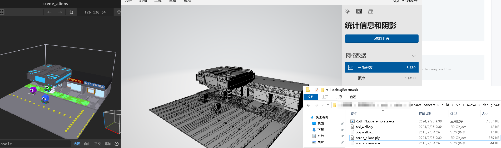

# Kotlin/Native Parser for MagicaVoxel

纯kotlin实现的MagicaVoxel解析器, 生成顶点和索引数组

parse .vox file to vertices and indices

OptVoxel.kt > buildMesh可以在libgdx或lwjgl中使用

OptVoxel.kt > buildMesh ready for libgdx(should convert intarray to shortarray) or lwjgl

```kotlin
val vc = VoxelLoader.load(fileBuffer)
val (v, i) = c.optimization().buildMesh()
val mesh = Mesh(true,
    v.size,
    i.size,
    VertexAttribute.Position(),
    VertexAttribute.Normal(),
    VertexAttribute.ColorUnpacked())
mesh.setVertices(v.toFloatArray())
mesh.setIndices(i.toShortArray())
```

vox文件转ply

convert .vox to .ply

```kotlin
val vc = VoxelLoader.load(fileBuffer)
val (v, i) = c.optimization().buildArray()
// 顶点过多时，会比较慢
// Can be slow when there are too many vertices
val buffer = convertPly(v, i, true)
// 如果不想压缩顶点，可以使用
// val buffer = vc.optimization().exportPly()
Path("your.path").writeBytes(buffer)
```



